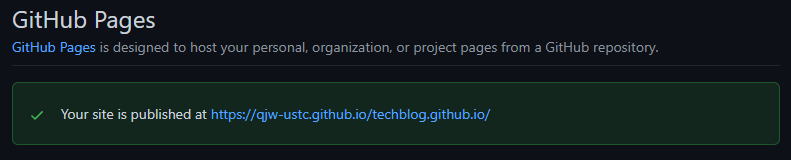

Hexo是一款开源的非常方便好用的博客框架, 与Github Pages结合可以实现完全免费的博客建站, 本文记录我的博客的搭建流程, 供大家参考.

> 我是在Ubuntu18.04 LTS Desktop环境进行的搭建, 本文命令示例也以此系统为基础介绍.

## 本地环境安装

### 安装Git和Nodejs

1. 安装Git

由于博客项目有在多终端上编辑的需求, 本身部署到GitPages上也有需求, 所以需要先安装Git.
Ubuntu安装:

``` shell
sudo apt install git-all
```

检查是否安装成功:
``` shell
git --version
```

其他平台如Mac可以通过XCode Command Line Tools安装, Windows平台下可以下载可执行文件进行安装. 参考官方[Git安装文档](https://git-scm.com/book/en/v2/Getting-Started-Installing-Git)

2. 安装Nodejs

比较熟悉的小伙伴可以用nvm或n来进行node的安装, 本文只介绍最基础的安装方式. (建议安装13及以上版本, 我的版本是v16.13.0)
从NodeSource安装:

``` shell
# 将NodeSource签名添加到系统, 如果需要其他版本可以改成 setup_{需要的版本号}
curl -sL https://deb.nodesource.com/setup_16.x | sudo -E bash -

# apt安装
sudo apt install nodejs

# 检查版本确认安装成功
node --version

# 同时查看npm版本
npm --version
```

### 安装Hexo客户端

接下来安装hexo命令行客户端, 一行命令搞定
``` shell
sudo npm install -g hexo-cli
```
安装后可以通过查看版本号确认安装是否成功
``` shell
hexo -v
```
我的安装版本是 hexo: 5.4.0, hexo-cli: 4.3.0

### 新建博客目录
- 首先新建博客代码存放的目录, 例如我的是```/home/qjw/workspace/blog```
- 进入该目录
- 执行初始化命令
```shell
hexo init
```
- npm安装依赖
```shell
npm install
```

### 本地预览
上述安装完成后, 便可以通过hexo的一键生成命令生成并预览自己的博客页面
```shell
# 清理命令 clean, 首次可以不执行
hexo c

# 生成命令 generate
hexo g

# 运行命令 serve
hexo s
```
执行后, 博客会在本地的```http://localhost:4000```地址运行, 就可以本地访问博客内容了!

## GitHub配置

我们的博客本地能正常运行且显示以后, 下一步就是想办法发布出去给更多的小伙伴看了, 接下来介绍使用GitPages部署的步骤.

### 新建项目和GitPages配置

1. 首先登录你的GitHub, 在repository中新建一个项目, 项目名称中必须包含```.github.io```


2. 点击项目的```Settings```, 并选择```Pages```选项, 选择一个主题, 按步骤操作后会有如下提示:



这说明项目已作为GitPages发布到了这个地址

### ssh密钥配置

接下来我们回到本地

1. 首先配置git的用户信息
```shell
git config --global user.name "qjw_ustc"
git config --global user.email "qjw_ustc@163.com"
```

2. 首先在本地生成一对ssh密钥
```shell
ssh-keygen -t rsa -C "qjw_ustc@163.com"
```

3. 其中公钥被保存在 ```~/.ssh/id_rsa.pub```, 打开它
```shell
cat ~/.ssh/id_rsa.pub
```

4. 回到```GitHub```的个人账号页面, 打开个人设置```Settings```, 选择```SSH and GPG keys```, 新建一个SSH, 名称任取.

5. 我们把公钥拷贝并粘贴在新建的SSH里面, 保存.

6. 回到本地, 对本地Git添加这个密钥

```shell
ssh -T git@github.com
```

如果提示 ```Hi 你的GitHub用户名! ...```, 就说明配置成功了!

## 尝试发布

接下来我们将本地的博客发布到已经配置好的```GitPages```上

1. 在本地项目路径下, 安装一个用于Git发布的插件
```shell
npm install hexo-deployer-git
```

2. 编辑博客根目录下的```_config.yaml```配置文件, 将```deploy```这个section改成这样:

```yaml
deploy:
  type: git
  repo: git@github.com:qjw-ustc/techblog.github.io
  branch: main
```

> 这里一定要注意, 项目地址不能用 ```https://``` 开头的地址, 必须用**git@github.com**, 否则无法用到配置的ssh密钥信息.

3. 保存后, 使用hexo提供的一键部署命令发布博客到远端地址

```shell
# 生成命令 generate
hexo g

# 部署命令 deploy
hexo d
```

然后再去刷新自己的```GitPages```地址, 就能看到博客页面啦!

> 如果还不能正常看到页面, 可以检查下```Pages```里面配置的分支是否与本地配置的远端分支一致, 如果不一致需要修改成一致的.

## 代码同步

针对我们在多台电脑上编辑博客的需求, 我们需要把博客代码也一起同步一下

**Tips:** 我们发布后此时在```GitHub```上看到的代码, 不是我们本地编辑时的代码, 而是由```Hexo```在部署前编译后的内容, 所以代码本身不能和这个混淆.

因此我们新开一个分支, 例如我的就是```hexo```分支, 并一套```add + commit + push```操作就可以啦!
```shell
git branch -b hexo
git add .
git commit -m "first commit"
git push origin hexo
```

接下来我会在后续文章中记录一些其他的美化和配置!

